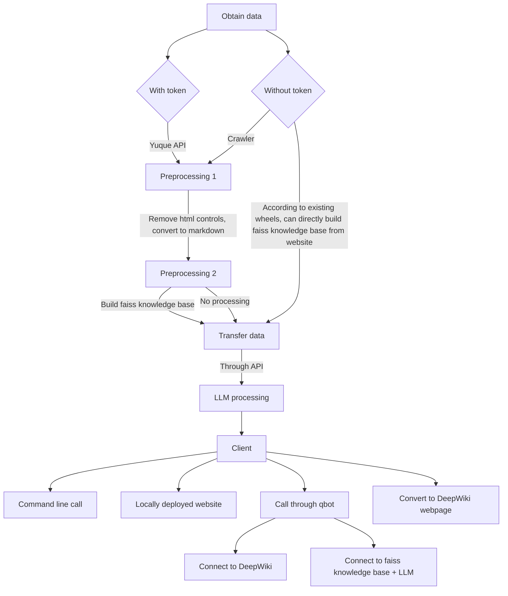
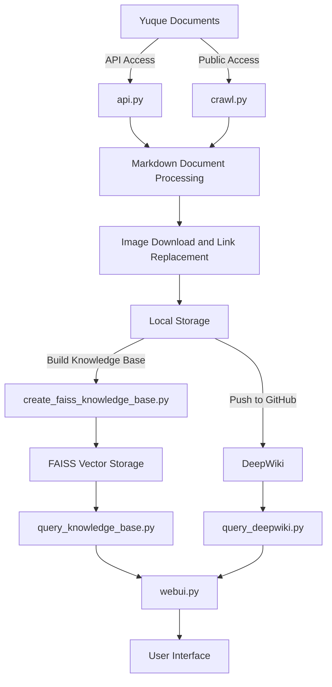

# Yuque Document Conversion Tool

This is the first practical project for Nanjing University's nova club written by the author. In this project, I will try my best to show my thinking process and restore my long-standing "starting from wheels" way of thinking; this way of thinking is conducive to quickly implementing more complex and complete projects. Based on my previous communication with teacher cac, relying on the "wheel-based" way of thinking will not be very beneficial for some future projects, so my project may be a negative example for most students. The reason why I still adopt this form is to show everyone (especially teacher cac) what my so-called "starting from wheels" way of thinking is like, for everyone to criticize and learn from.

## Simplified Reproduction Tutorial
Since some comrades reported that they couldn't understand what I was doing through my documentation, I provide a simplified reproduction tutorial here.

1. Clone the repository: `git clone https://github.com/ChouYuanjue/Yuque_LLM_Wiki`
   (If `ssh` is configured, it is recommended to use `git clone git@github.com:ChouYuanjue/Yuque_LLM_Wiki.git`)
2. Enter the repository directory: `cd Yuque_LLM_Wiki`
3. Install dependencies: `pip install -r requirements.txt`
4. Create a .env file and fill in the following content (format as follows):
    ```env
    # SiliconFlow API key (for embedding and LLM calls)
    SILICONFLOW_API_KEY=sk-xxxxxxxxxxxxxxxx

    # Yuque API key (only for api.py, optional)
    YUQUE_TOKEN=xxxxxxxxxxxxxxxx
    ```
5. Get Yuque documents:
   - With Token: `python api.py <Yuque knowledge base URL>`
   - Without Token: `python crawl.py <public Yuque knowledge base URL>`
6. Build the knowledge base:
   ```bash
   python create_faiss_knowledge_base.py <path to folder containing md files> [collection name]
   ```
   - `<path to folder containing md files>`: Required, pointing to a specific directory under api/ or crawl/
   - `[collection name]`: Optional, the name of the knowledge base collection, default is 'default_knowledge_base'
   - Example: `python create_faiss_knowledge_base.py api/68727525 nova`
7. Configure the knowledge base collection name called by WebUI in `config.json` (such as `nova` just created), that is, modify the `default_collection` parameter of `vector_store`.
8. Start the Web interface: `streamlit run webui.py`

## Preliminary Implementation Ideas

The following is the plan I immediately generated based on my long-term experience in doing projects after seeing the project topic. Any link I envisioned below is something I am sure I can implement myself/by modifying wheels. The advantage of "experience" is that it avoids unrealistic implementation ideas and also avoids being stuck on certain issues. The disadvantage is that once this thinking is formed, it will subconsciously treat every project by modifying and stacking wheels, refusing to spend time trying unknown implementation methods, and it is also prone to redundant calling steps.



## Idea Analysis
If we pass all documents directly to the API of our commonly used large models, it is usually not a good solution, because this will lead to high cost of API calls, and the context length of the model is usually limited and cannot handle all documents. So it is better to call the faiss knowledge base; of course, this solution also has defects, which I will mention below. If we really want to pass all documents, I think DeepWiki is a good choice. This project can be deployed locally, but we do not adopt the local solution here. We can directly push the obtained documents to github, and let DeepWiki generate interactive documents based on the github repository. DeepWiki actually calls a model specialized for understanding code implementations, which has obvious advantages in context understanding. Although it is not directly applicable to this project, it can also achieve very good results. The reason I thought of DeepWiki is that I didn't want to write documentation when I wrote the bot, so I found this interactive assistant, connected it to the bot's repository, allowing users to directly consult the bot about the usage and specific implementation of various functions.

Regarding the problem of tables and images in the crawled documents, tables can be initially converted into markdown format, which does not affect the LLM's understanding of them. Images need special processing: one is to extract text through OCR and then pass it to LLM, and the other is to pass it to LLM after paraphrasing through VLM. Of course, I think the best solution is to pass all to the Embedding model + multimodal large model, but I have never tested it, and I don't know how to call the API of the multimodal model and whether it must go through the preprocessing of the Embedding model. The free Embedding models I know do not seem to support processing data other than text. Models that may support this function are not intended to be tried for the time being due to network environment and cost issues. The processing of images is temporarily added to the TO-DO list.

In addition, regarding sensitive information such as tokens and API keys, I will store them in the .env file to avoid hardcoding into the code. Before this, I pushed such information to public warehouses many times and had to overwrite them through forced pushes, so I must develop the habit of writing .env (sad).

## Specific Implementation Ideas
I will complete the implementation of two data acquisition methods: API and web crawler, convert them into markdown, and establish a script to push to DeepWiki webpage. At the same time, I will complete the call of LLM through the faiss knowledge base for a slightly more complex but more localized and controllable implementation. In this process, I will demonstrate the two cases of Nanda Assistant's Yuque (without token) and nova documents (with token) respectively. For the final client implementation, I will try to use a locally deployed website (WebUI) for easy visual calling by everyone, and may eventually deploy an open demo on the server.

### A. Yuque API + DeepWiki (+WebUI)

The simplest and fastest implementation method. Can realize question and answer interaction. The disadvantage is that DeepWiki will automatically update documents according to the warehouse only once a week.

### B. Yuque API + faiss knowledge base + LLM (+WebUI)

The reason I thought of this way is that my own bot's knowledge base is implemented like this. The general principle can be understood as first cut the document into pieces, then store the embedding of each block in the faiss knowledge base. When answering questions, first compare the embedding of the question with the embedding in the faiss knowledge base, find the most similar blocks, and then pass these blocks to the LLM as context for processing. The advantage is that the prompts that LLM needs to process are significantly reduced. The disadvantage is that the context obtained by LLM may not be the most relevant, may be wrong, and is also likely to be incomplete. It is necessary to call the Embedding model to encode the context.

### C. Crawler + DeepWiki (+WebUI)

Same as scheme A, but can be used for Yuque documents that do not provide tokens but are public.

### D. Crawler + faiss knowledge base + LLM (+WebUI)

Same as scheme B, but can be used for Yuque documents that do not provide tokens but are public.

### E. Directly process web pages to build faiss knowledge base + LLM (+WebUI)

Due to the availability of complete wheels, only relevant links are posted here. Note that this project provides an API port callable by AstrBot, which is convenient for calling when writing plug-ins. It cannot be used out of the box, and you need to understand its principles and modify it according to needs. The project can be found here: [RC-CHN/astrbot_plugin_url_2_knowledge_base](https://github.com/RC-CHN/astrbot_plugin_url_2_knowledge_base)

### F. Implementation based on qbot

The implementation idea is basically the same as above. The advantage is that there are more available wheels. Through AstrBot's built-in LLM calling, knowledge base visual construction and other functions, it can be easily implemented. However, it involves many project dependencies and is also not ready-to-use. There is no plug-in that can be directly installed, so it is not recommended for students without bot writing experience.

## Final Implementation

This project has completed the implementation methods A, B, C, and D above; the F implementation method can be found in [ChouYuanjue/doge-repo/v4](https://github.com/ChouYuanjue/doge-repo/tree/master/doge-v4). Chatting with the bot and sending `/wiki <repository name> <question>` can ask DeepWiki, and sending `/kb use <knowledge base name>` can call the knowledge base in natural language conversations with the bot (can be imported through AstrBot's WebUI, which automatically parses and generates the knowledge base).

### 1. System Architecture Overview

The current system mainly consists of the following core modules:

1. **Data Acquisition Layer**: Obtain Yuque documents through API or crawler
2. **Data Processing Layer**: Convert documents to markdown and process image resources
3. **Knowledge Base Construction Layer**: Create a vector knowledge base based on FAISS
4. **Query Service Layer**: Provide two query methods: knowledge base query and DeepWiki query
5. **User Interface Layer**: WebUI interface based on Streamlit



### 2. Detailed Description of Core Modules

#### 2.1 Data Acquisition Module

**2.1.1 API Method (requires Token)**

The `api.py` module provides the function of obtaining documents through the official Yuque API. The main process is:
1. Read `YUQUE_TOKEN` from the environment variable `.env`
2. Parse the input Yuque knowledge base URL and extract necessary parameters
3. Obtain knowledge base metadata and directory structure through API
4. Traverse each document in the directory and call the API to obtain markdown content
5. Download images in the document and replace links with local paths
6. Generate `SUMMARY.md` file as directory index

**Usage**:
```bash
python api.py <Yuque knowledge base URL>
```

**2.1.2 Crawler Method (no Token required)**

The `crawl.py` module provides the function of crawling public Yuque documents. The main process is:
1. Visit the Yuque knowledge base page and extract embedded JSON data
2. Parse JSON data to obtain document structure and content
3. Traverse documents and obtain complete markdown content through API
4. Traverse each document in the directory and call the API to obtain markdown content
5. Download images in the document and replace links with local paths
6. Generate `SUMMARY.md` file as directory index

**Usage**:
```bash
python crawl.py <public Yuque knowledge base URL> 
```

#### 2.1.3 Comparison between API and Crawler Methods

Although the `api.py` and `crawl.py` modules target different access scenarios (with Token and without Token), their core implementation logic and code structure are very similar, with only minor differences:

**Similarities**:
1. The ultimate goal is the same: both obtain Yuque documents and save them in markdown format
2. Image processing logic is completely the same: both download remote images and replace them with local links
3. The output format is consistent: both generate markdown documents and SUMMARY.md index files
4. Most auxiliary functions are common: such as `_retry_get`, `_ensure_dir`, `_save_binary`, etc.

**Minor differences**:
1. **Different access permissions**: The API method requires a Token and can access private documents; the crawler method does not require a Token and can only access public documents
2. **Different data acquisition methods**: The API method directly calls the official API interface to obtain data; the crawler method obtains data by parsing page content and calling unofficial APIs
3. **Different URL parsing methods**: The API method parses the URL to obtain `group_login` and `book_slug`; the crawler method extracts embedded JSON data from the page
4. **Details of directory structure processing**: The crawler method supports more complex hierarchical directory structures

#### 2.2 Knowledge Base Construction Module

The `create_faiss_knowledge_base.py` module is responsible for building the obtained documents into a FAISS vector knowledge base. Its main functions are:

1. **Document chunking**: Split long documents into appropriately sized chunks
2. **Vectorization processing**: Use Embedding models (such as GTE-large) to convert text into vector representations
3. **Batch processing and retry mechanism**: Support batch processing of documents and automatic retry on failure
4. **FAISS index construction**: Create efficient vector indexes for similarity search
5. **Persistent storage**: Save indexes and document metadata to the local file system

This module provides a complete asynchronous API and supports high-concurrency processing of large numbers of documents.

#### 2.3 Query Service Module

**2.3.1 FAISS Knowledge Base Query**

The `query_knowledge_base.py` module implements semantic search and LLM answer generation functions based on FAISS:

1. **Similarity search**: Convert user queries into vectors and find the most similar document fragments in the FAISS index
2. **Context construction**: Construct the retrieved document fragments into context
3. **LLM call**: Send the context and user query to the large language model (such as Qwen2-7B) to generate answers
4. **Result formatting**: Return answers to users in a user-friendly format

**Usage**:
```bash
python query_knowledge_base.py <knowledge base name> <query content>
Example: python query_knowledge_base.py nju history of Nanjing University
```

**2.3.2 DeepWiki Query**

The `query_deepwiki.py` module provides the function of querying documents in GitHub repositories through the DeepWiki API:

1. **Request construction**: Encapsulate user queries into DeepWiki API request format
2. **Asynchronous communication**: Use aiohttp to implement asynchronous requests and polling
3. **Result parsing**: Extract and format the results returned by DeepWiki

**Usage**:
```bash
python query_deepwiki.py [repository name] <query content>
Example 1: python query_deepwiki.py Nanjing University freshman admission guide
Example 2: python query_deepwiki.py ChouYuanjue/Guidance_for_New_NJUers Nanjing University freshman admission guide
```

#### 2.4 Web Interface Module

The `webui.py` module implements a user-friendly Web interface based on Streamlit:

1. **Configuration loading**: Read system configuration from `config.json`
2. **Query method selection**: Support switching between DeepWiki and FAISS knowledge base query methods
3. **Result display**: Display query results in the form of text areas
4. **Exception handling**: Capture and display various error messages

**Usage**:
```bash
streamlit run webui.py
```

### 3. Configuration Instructions

The system is mainly set through two configuration files:

#### 3.1 `.env` file

Store sensitive information in the following format:
```
SILICONFLOW_API_KEY=your_siliconflow_api_key
YUQUE_TOKEN=your_yuque_token
```

#### 3.2 `config.json` file

Store system configuration parameters:
```json
{
  "embedding": {
    "api_url": "embedding_api_url",
    "model_name": "embedding_model_name"
  },
  "llm": {
    "api_url": "llm_api_url",
    "model_name": "llm_model_name",
    "temperature": 0.7,
    "max_tokens": 2000
  },
  "vector_store": {
    "path": "vector_store",
    "default_collection": "nju"
  },
  "deepwiki": {
    "base_url": "https://api.devin.ai/ada/query",
    "referer": "https://deepwiki.com/",
    "default_repo_name": "ChouYuanjue/Guidance_for_New_NJUers"
  },
  "webui": {
    "port": 7860
  }
}
```

### 4. System Workflow

#### 4.1 Knowledge Base Construction Process
1. Run `api.py` or `crawl.py` to obtain Yuque documents
2. Documents are saved in markdown format, and images are downloaded locally
3. Run `create_faiss_knowledge_base.py` to create a vector knowledge base
4. Knowledge base files (.index and .db) are saved to the vector_store directory

#### 4.2 Query Process
1. Users submit queries through the Web interface or command line
2. The system executes different processes according to the selected query method:
   - **FAISS method**: Convert query to vector → Search for similar documents in the knowledge base → Construct context → Call LLM to generate answers
   - **DeepWiki method**: Send a request to the DeepWiki API → Poll to get results → Parse and return answers
3. Results are returned to the user interface for display

## TO-DO LIST

- [ ] Processing of images
- [ ] Automatic document update
- [ ] More scientific knowledge base construction (such as cluster summary)
- [ ] Deploy the project on the server
- [ ] Add PageRank