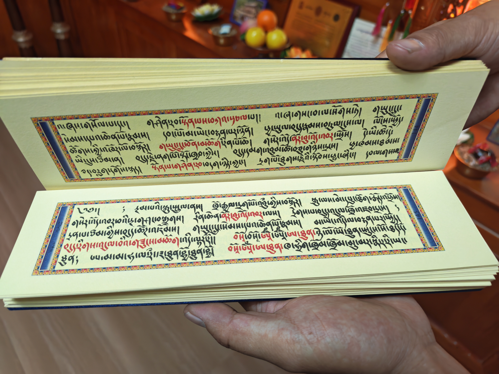

## Field Investigation Record

**Origin: From Chuansi Temple to Gami Monastery, the Greatest Discovery Was in the Homestay**

The starting point of this event was my **Sichuan-Tibet Border Journey**, following the idea of exploring Tibetan Buddhism. I visited Chuansi Temple and Gami Monastery. However, the greatest discovery and the unexpected "field investigation" occurred in the **homestay** where I was staying.

***

### Phase I: Initial Identification of the Deity at the Entrance, Verification via Group Chat, and Color Correction

1.  **Curiosity-Driven:** I became curious about the image of the deity hanging at the homestay’s entrance and asked the host about the name of the Buddha or Principal Deity (**Yidam**) (see Annotation 4).

2.  **Host's Answer and Misunderstanding:** The host replied, "Mahā." Due to my preliminary knowledge of Tibetan Buddhism, **"Mahā" led me to associate it with "Mahākāla" (玛哈嘎拉), the Great Black One** (see Annotation 1). I initially thought it was a Mahākāla image.
3.  **Key Correction (Golden Relief):** As the discussion deepened, I reiterated the material of the original image: it was a **pure golden relief** (similar to a gilded relief). This information negated the color clue, making it impossible to directly determine the deity based on color alone.

### Phase II: Verification Assisted by Group Members, Feature Analysis, and the Final Conclusion (Yellow Jambhala)

The discussion within the group centered on the deity's features: "golden, two-armed, standing pose, peaceful countenance."

*   **Exclusion of Mahākāla:** Group members pointed out that common Mahākālas are in the **wrathful aspect (忿怒相)** (see Annotation 5), whereas the image I provided had a **peaceful countenance** and **only two arms.** Thus, it could not be the common wrathful Mahākāla.

*   **New Direction and Focus:** The discussion established that the deity possessed the general characteristics of a Wealth Deity: peaceful countenance, holding Dharma implements (**法物**), seated or standing posture. **Through the identification and confirmation of the core element, the "Jewel-Spitting Mongoose (吐宝鼠)," the focus narrowed down to Yellow Jambhala** (Tibetan: ཛམ་བྷ་ལ་སེར་པོ, *Dzambhala ser po*) (see Annotation 2).
*   **Clarification of "Mahā":** The group also clarified that "Mahā" does not exclusively refer to Mahākāla; it can be a general reference to the great or profound quality of the Principal Deity.
*   **Final Conclusion:** Combining the features—the deity was **golden**, had a **peaceful countenance**, and was **two-armed with held objects**—we ultimately determined that the image at the entrance was highly likely **Yellow Jambhala**, correcting my initial misunderstanding caused by the host's single word, "Mahā."

### Phase III: The Unexpected Surprise in the Homestay's Shrine Room and the Verification of the Second Thangka

1.  **Deep Background of the Homestay:** Upon further inquiry, the host revealed that his **younger brother is the next abbot (住持) of Chuansi Temple**, which is why their family maintains **one of the best private shrine rooms (经堂, *Jīngtáng*) in the vicinity** (see Annotation 3).
   
2.  **Unexpected Permission to Photograph:** I was granted permission to enter the shrine room and photograph most of the thangkas (I refrained from photographing individual statues out of respect). This collection of precious material far exceeded the documentation I obtained at the monasteries.
3.  **Second Group Inquiry (Second Thangka):** I shared one of the vibrant, multi-faced, multi-armed thangkas with the group for a second round of verification.
4.  **Group Discussion and Multi-Aspect Identification (Five-Color Dakinis):**
   
    *   *Initial Guesses:* Initial guesses included **Vajrayoginī** (金刚亥母) (see Annotation 6), the Nine Dakinis, or **Uṣṇīṣavijayā** (尊胜佛母) (see Annotation 7).
    *   *Confirmation:* Through careful observation, I confirmed that the thangka had **multiple faces stacked vertically**, and the color scheme matched the **Five Colors**.
    *   *Final Tendency:* Ultimately, the discussion leaned toward confirming my observation that this thangka conformed to the representation of the **Five-Color Dakinis** (Tibetan: མཁའ་འགྲོ་མ་, *mkha' 'gro ma*). The discussion also touched upon the concepts of the Dakinis' **Peaceful Aspect (寂静相)** (see Annotation 5) and **Wrathful Aspect (忿怒相)**.

***

## Self-Summary and Reflection

This trip's greatest discoveries were not in the planned scenic spots but in the "unexpected surprise" within the homestay.

*   **Academic Verification and Information Error:** I thank the all-knowledgeable group members; their expertise **corrected my initial misunderstanding of the first deity image** and **eliminated the initial misjudgment caused by the color displayed on my phone**, ultimately confirming it as **Yellow Jambhala**. This compensated for the unfortunate situation where the host himself was not fully knowledgeable about the deity worshipped in his own home.
*   **Research Difficulty and Affinity/Karma (缘分):** I am deeply interested in the study of religious sociology, but I am aware that Chinese language materials on Tibetan Buddhism are difficult to collect, and the field is challenging for beginners. My lack of thorough preparation before the trip led to me feeling "at a loss" at the temple sites. However, obtaining this batch of **high-quality, context-rich thangka images** in the homestay, coupled with the professional assistance of the group members, felt like an **unexpected affinity and good karma**.
*   **Motivation for Research:** This experience has greatly stimulated my interest in continuing to learn and research Tibetan Buddhism in depth. **From Chuansi Temple to Gami Monastery, the greatest discovery was in the homestay**—this has become the most profound memory of the trip.

***

## Annotations

**Annotation 1: Mahākāla (玛哈嘎拉)**
*   **Concept:** A prominent **Dharma Protector (Dharmapāla)** in Tibetan Buddhism (Sanskrit: *Mahākāla*), meaning "Great Black One." He is primarily revered in his **wrathful aspect**, often depicted as multi-armed and typically black or deep blue in color.

**Annotation 2: Yellow Jambhala (黄财神)**
*   **Concept:** The most popular of the five Buddhist Wealth Deities (Tibetan: ཛམ་བྷ་ལ་སེར་པོ, *Dzambhala ser po*). He is depicted in a **peaceful aspect**, colored yellow or gold, and is characteristically shown holding a **Jewel-Spitting Mongoose** (*Nakula*) in his left hand, which symbolizes his ability to generate wealth and eliminate poverty.

**Annotation 3: Jingtang (经堂)**
*   **Concept:** The Chinese term (*Jīngtáng*) for a private or family shrine room/chapel in a Tibetan Buddhist home. It is a dedicated space for daily prayers, rituals, and the storage and display of religious art, such as statues and thangkas.

**Annotation 4: Principal Deity (Yidam)**
*   **Concept:** In Vajrayāna Buddhism, the Yidam (Tibetan: ཡི་དམ་, *yi dam*) is a tutelary or meditation 
  
## Gallery

