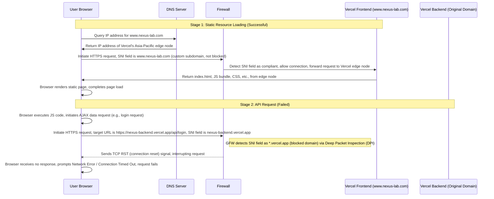

## Overview

Deploying Web services in mainland China requires ICP filing — an administrative requirement mandated by China’s Ministry of Industry and Information Technology. During the approximately 20-day "filing window" period, which follows submission and before official approval, domain names pointing to domestic servers must remain silent — unable to serve any actual content or functionality. This poses a significant challenge for early-stage startups urgently needing to validate product-market fit and capture early adopters. This article documents a complete, real-world technical implementation that enables traffic "smuggling" during the ICP filing window while remaining fully compliant with regulations. It covers core strategy design, practical deployment challenges encountered (including microservice-GFW conflicts and third-party callback anomalies), solution implementation, and the construction and upgrade of a security protection system — preserving every technical detail and troubleshooting process for teams facing similar constraints.

---

## The Dilemma and Initial Vision During the ICP Filing Window

In mainland China, deploying Web applications involves an unavoidable administrative process — **ICP Filing (Internet Content Provider Filing)**. Simply put, this is an administrative license required by China’s Ministry of Industry and Information Technology (MIIT). Any website hosted on servers within mainland China must bind its domain to the server and submit detailed identity information for review. The review process covers domain owner information, hosting provider credentials, website operator identity, and contact details — ensuring the legality and traceability of website operations. This review process is subject to MIIT workload and material completeness, typically requiring around 20 working days, and may extend to 30 days if additional materials are required.

During this waiting period, known within the industry as the "filing window" or "blocking period," there is a strict requirement: to pass MIIT’s manual review, servers pointed to by domain names must remain inaccessible or only display static pages indicating “Website under construction” or “Filing under review.” Any actual business content or interactive functionality will directly lead to filing rejection, requiring resubmission and re-waiting for the review cycle.

For a startup urgently needing to launch and validate product viability, capturing market opportunities, this 20-day (or longer) waiting period is extremely costly — it delays product iteration, misses market windows, increases operational costs, and hinders early seed user acquisition. A few days ago, I conceived the idea of “smuggling” traffic — aiming to legally and compliantly bypass the access restrictions during the filing window, using technical means to allow target users to access our service early and gather initial product feedback. It should be noted that all specific domain names mentioned below are illustrative examples only, used solely for technical demonstration purposes and have no relation to actual operational services or real domains.

## The Ideal "Dual-Track" Smuggling Plan

My core strategy stems from deep utilization of DNS resolution flexibility, based on the principle: “Main domain remains compliant and silent, subdomain enables flexible redirection.” This approach strictly adheres to ICP filing requirements while leveraging subdomain resolution rules to achieve legal “smuggling” of traffic. Specifically, our main domain `nexus-lab.com` must strictly comply with filing regulations — always pointing to Tencent Cloud’s domestic server IP address, with the server remaining completely silent — all business ports closed, only retaining basic server operational status, providing no accessible content to external users — ensuring MIIT’s manual review passes and avoiding filing rejection due to unauthorized access via the main domain.

After thorough investigation and real-world testing of ICP filing rules, we discovered a critical rule: the subdomain `www.nexus-lab.com` will not be forcibly shut down during the main domain’s filing period. Its core restriction is merely “not resolving to a domestic server IP.” As long as this condition is met, the subdomain can operate normally and does not violate ICP filing regulations. This rule became the core breakthrough for our entire smuggling plan — the foundational premise for designing our "dual-track" strategy.

Based on this breakthrough, I designed a complete "dual-track" smuggling solution with the following implementation steps and technical details:

1. Precisely configure DNS resolution to point the subdomain `www.nexus-lab.com` via CNAME record to our frontend deployment on Vercel: `v0-nexus-self.vercel.app`. We chose Vercel as the frontend deployment platform for two key reasons: (1) Vercel uses an edge computing architecture, deploying edge servers globally — especially in Asia-Pacific regions (Hong Kong, Singapore nodes) — enabling low-latency user access; (2) Vercel natively supports custom domain binding without requiring ICP filing — only domain ownership verification is needed, perfectly aligning with our needs during the filing window.

From a technical standpoint, domestic DNS servers resolve our custom subdomain `www.nexus-lab.com` normally — unaffected by the filing window restrictions. When users enter this subdomain in their browser, DNS servers resolve it to the IP address of Vercel’s edge node in the Asia-Pacific region (Hong Kong or Singapore). This approach has two core advantages: (1) it bypasses GFW interference with Vercel’s default domain (`*.vercel.app`), preventing users from being unable to access the service due to GFW blocking; (2) users require no VPN or additional configuration — enabling direct, seamless access and minimizing user friction.

Initially, I believed this "dual-track" plan would seamlessly cover the filing window period, achieving smooth traffic smuggling. Once the main domain `nexus-lab.com` passes filing after 20 days, we simply need to adjust DNS settings to point both the main domain and subdomain `www.nexus-lab.com` to the domestic server IP and integrate domestic CDN acceleration services (e.g., Tencent Cloud CDN, Alibaba Cloud CDN) to complete the transition from the transitional environment to the production environment. This transition is completely transparent to users — they always access the service via `www.nexus-lab.com`, experiencing only faster loading speeds (due to CDN acceleration), without ever noticing backend server migration. This smooth transition not only meets our traffic needs during the filing window but also provides a practical rehearsal for future traffic routing, blue-green deployment, and other operations — laying a solid foundation for stable production environment operation.

However, reality often diverges from idealism — actual deployment was far from smooth. After completing all DNS configurations and Vercel deployments, I confidently accessed `www.nexus-lab.com`, only to find that while the frontend page loaded instantly and static resources (HTML, CSS, JS files) loaded normally, every subsequent click operation felt inert — all requests involving data interaction (e.g., user login, data queries, submission operations) failed. Browser console frequently reported errors such as “Network connection timeout” and “SSL connection failed,” leaving the service stuck in a state of “visible but unusable.”

## Reality’s Gravity: Collision Between Microservices and GFW

After repeated troubleshooting and testing, I ultimately pinpointed the root cause: I had severely misjudged how a “frontend-backend separation” architecture behaves under different network environments. During design, I only focused on “whitewashing” the frontend — i.e., binding a custom subdomain to Vercel to ensure frontend accessibility — while neglecting the network context of backend services, leading to broken communication between frontend and backend — ultimately resulting in “frontend accessible but data interaction failures.”

To understand this issue, we must first clarify our project’s architecture design: Our project employs Vercel’s Serverless architecture, chosen primarily to reduce deployment costs and enhance scalability flexibility — tailored to the resource constraints of early-stage teams. However, Vercel imposes a limit of 12 Serverless Functions per project — insufficient for our relatively complex business logic requiring multiple cloud functions (e.g., user authentication, data processing, third-party API calls). To resolve this, we split frontend and backend into two independent code repositories for deployment — achieving architectural separation: frontend code repository deployed at `v0-nexus-self.vercel.app`, primarily handling page rendering, user interaction, and frontend logic; backend code repository deployed at `nexus-backend.vercel.app`, primarily managing business logic, data storage, and API provision — communicating via HTTPS APIs.

Considering the transitional environment during the filing window, when users access our configured custom subdomain `www.nexus-lab.com`, frontend resources (HTML, CSS, JS) load from Vercel’s edge node. Since we bind a custom subdomain, it successfully bypasses GFW interference — enabling normal frontend page loading — explaining why I initially saw instant page loads. However, frontend code references to backend API endpoints — whether hardcoded or configured via environment variables — still point to the backend’s original Vercel domain `nexus-backend.vercel.app` — a domain subject to GFW interception — leading to all data interaction requests failing to reach the backend.

Upon deeper analysis, the core issue lies in GFW’s deep packet inspection mechanism — modern firewalls have evolved beyond simple IP blacklists, now employing **SNI (Server Name Indication)** for deep interception. SNI is an extension field in the TLS protocol used during SSL/TLS handshake to let clients inform servers of the target domain — enabling servers to return appropriate SSL certificates for multiple domains hosted on one server. GFW inspects the SNI field during SSL/TLS handshake — if it detects a blocked domain (e.g., Vercel’s default domain `*.vercel.app`), it directly resets TCP connections, blocking further transmission — the root cause of backend API request failures.

To clearly illustrate this process, I created the following sequence diagram, detailing the network flow and interception for the two core stages (static resource loading and API requests):



The sequence diagram clearly shows that frontend page loading succeeds because its SNI field is our custom subdomain `www.nexus-lab.com`, not blocked by GFW; however, backend API requests fail because their SNI field is Vercel’s default domain `nexus-backend.vercel.app`, intercepted by GFW via SNI detection — leading to TCP connection reset and request failure.

Upon deeper reflection, this issue stems not merely from domain misconfiguration but from a fundamental architectural misunderstanding caused by environmental differences — our project must run in three distinct network environments and architectures, yet I failed to fully consider these differences, misapplying architectural logic — ultimately causing the problem. The three core differences are as follows — also serving as our subsequent optimization blueprint:

The first is the local development environment — characterized by “full connectivity,” with no network restrictions. During local development, the frontend runs on `localhost:3000`, the backend on `localhost:3002`, and communication between them occurs via simple proxy configurations (e.g., frontend webpack-dev-server proxy) — even without public network transmission — extremely low latency and immune to firewall or network policy interference — explaining why we never encountered issues during local development.

The second is the target production environment (after filing completion) — characterized by “monolithic deployment and internal network communication.” After filing, we will deploy frontend and backend code onto the same domestic physical server — frontend resources deployed via Nginx, backend services running on internal server ports — communication between frontend and backend no longer traverses public networks — Nginx forwards requests via loopback interface (`127.0.0.1`) to backend services — communication latency is nearly negligible and highly secure — our ideal operational environment.

The third is the current transitional environment (Vercel deployment during filing window) — the most complex and challenging among the three. Its core characteristics are “frontend-backend physical separation, public network communication, and multiple restrictions” — frontend and backend deployed on two separate Vercel projects, running on different edge nodes — communication between them must traverse public HTTPS — subject to GFW SNI interception and Serverless cold-start issues. We incorrectly applied the production environment’s “monolithic deployment and internal network communication” logic to Vercel’s “distributed, public network communication” architecture — ignoring network topology differences — inevitably facing network restrictions — the root cause of backend API request failures.

## The Trap of Third-Party Callbacks: Feishu Synchronization Function

In addition to user-side access issues (static pages accessible, API requests failing), backend service interactions with third-party services also encountered unexpected consistency failures — most notably, our core feature — Feishu (Lark) multidimensional table synchronization — became intermittently unreliable.

This feature’s core function is to synchronize data from Feishu’s multidimensional table (e.g., user information, business configurations, task lists) into our backend database — enabling unified data management and business coordination — an indispensable part of our core business workflow.

During local development, this feature operated stably — I used a local tunnel tool to expose the backend service’s port to the public internet, obtaining a temporary public address, which I configured as Feishu’s multidimensional table webhook callback address. When Feishu’s multidimensional table data changed, Feishu servers would proactively send callback requests to this temporary public address — the tunnel tool forwarded requests to the local backend service — which executed data synchronization logic — the entire process flowed smoothly without any anomalies.

However, after deploying the backend service to Vercel, the Feishu synchronization function exhibited intermittent failures — sometimes syncing successfully, sometimes completely failing — with no fixed failure pattern — making troubleshooting extremely difficult. After extensive log analysis, request monitoring, and repeated testing, we finally pinpointed the root cause — primarily two technical challenges, which compounded to cause the intermittent failures.

The first technical challenge is **network connectivity issues**. From a network perspective, Feishu servers are primarily deployed within mainland China — not blocked by GFW — theoretically capable of accessing public backend services. However, Vercel’s Serverless architecture has a core characteristic: the IP addresses assigned to cloud functions are shared and frequently change — often every hour or even every minute — causing instability that triggers Feishu’s internal security risk control policies — Feishu blocks requests from unstable IP addresses — leading to callback failures — and IP address fluctuations may also cause network fluctuations — resulting in request timeouts or connection interruptions — further exacerbating synchronization instability.

The second technical challenge — and more severe — is **Serverless cold-start (Cold Boot) issues**. Feishu’s webhook callback has a strict time limit — typically requiring backend services to return a `200 OK` response within a very short time (Feishu officially recommends within 3 seconds) — otherwise, Feishu will deem the request timed out and trigger retry mechanisms — typically 2-3 retries — if all retries timeout, Feishu will deem the callback failed and log the failure. However, Vercel’s Serverless cloud functions suffer from inherent cold-start defects — if a cloud function hasn’t been called for a long time (typically over 5-10 minutes), it enters sleep mode and releases server resources — when new requests arrive, it must be re-awakened, code loaded, and runtime environment initialized — this process typically takes 1-5 seconds, or even longer (depending on code volume and dependencies).

This cold-start time directly conflicts with Feishu’s timeout limit — when Feishu initiates a callback request, if the backend cloud function is in sleep mode, cold-start time may exceed 3 seconds — causing Feishu to fail to receive `200 OK` within the specified time — triggering timeouts and retries. We can represent the failure probability with this simple probability formula:

$$ P(\text{Failure}) = P(\text{NetworkBlock}) + P(\text{ColdBoot} > T_{timeout}) $$

Where $ P(\text{NetworkBlock}) $ is the failure probability due to network connectivity issues (IP changes blocked, network fluctuations), and $ P(\text{ColdBoot} > T_{timeout}) $ is the failure probability due to Serverless cold-start exceeding Feishu’s webhook timeout ($ T_{timeout}=3s $). The two factors compound — directly causing Feishu’s synchronization function intermittent failures.

More critically, this timeout retry mechanism can trigger a classic business issue — “double-spending” or duplicate writes. Specifically, when Feishu initiates the first callback request, the backend cloud function successfully executes the data synchronization logic — writing Feishu’s multidimensional table data into our database — but due to cold-start time exceeding the limit, Feishu doesn’t receive `200 OK` within the specified time — deems the request failed — and initiates a second callback request — by this time, the backend cloud function is already active — quickly receives and processes the second request — again executing data synchronization logic — ultimately causing duplicate data writes into the database. However, this issue is relatively easy to resolve — we added a brief deduplication logic in our backend synchronization logic — using Feishu’s multidimensional table data ID as a unique identifier — checking if data with that ID already exists in the database before synchronization — if it exists, skip synchronization — if not, execute synchronization — thus avoiding duplicate writes.

## The Final Defense Line: Security and Authentication

Facing the aforementioned network isolation (frontend-backend communication failure) and third-party callback anomalies (Feishu synchronization failure), I realized the necessity of comprehensively upgrading our architecture and configuration — core strategy: “Full domain spoofing, enhanced security configuration.” We must not only solve network connectivity issues — enabling frontend-backend communication and stable third-party callback execution — but also ensure system security — avoiding introducing new security risks due to architectural upgrades. The most fundamental and critical step is binding a custom subdomain to the backend service (e.g., `api.nexus-lab.com`) — allowing the backend service to wear a “custom domain” disguise — bypassing GFW’s SNI detection — resolving frontend-backend communication failures.

After binding custom subdomains to both frontend and backend on Vercel (frontend `www.nexus-lab.com`, backend `api.nexus-lab.com`), our system architecture underwent a fundamental transformation — from the original asymmetric architecture (“frontend custom domain, backend default domain”) to a true distributed cross-domain architecture. Now, a problem previously non-existent in monolithic server deployments — **CORS (Cross-Origin Resource Sharing)** — has become our primary adversary.

To understand CORS issues, first clarify the browser’s same-origin policy — browsers restrict resource access between different origins (protocol, domain, port — any differing element) for security — when the frontend page (origin `https://www.nexus-lab.com`) attempts to access the backend interface (origin `https://api.nexus-lab.com`), since the domains differ (even though under the same main domain, they still constitute different origins), browsers trigger same-origin policy restrictions — blocking requests or rejecting responses — leading to frontend-backend communication failure.

Solving CORS issues requires explicitly declaring allowed origins in the backend — informing browsers “this backend interface allows requests from specified origins.” In Vercel deployment environments, we have two common configuration methods: configuring via `vercel.json` for global headers or dynamically configuring via middleware in backend code. Considering our need to allow frontend subdomain access and support multiple HTTP methods (GET, POST, PUT, DELETE) and credential transmission (e.g., cookies), we chose global configuration via `vercel.json` — simple, broad-scope, and effective for all backend interfaces. The specific configuration code is as follows:

```json
{
  "headers": [
    {
      "source": "/api/(.*)",
      "headers": [
        { "key": "Access-Control-Allow-Origin", "value": "https://www.nexus-lab.com" },
        { "key": "Access-Control-Allow-Methods", "value": "GET,POST,PUT,DELETE,OPTIONS" },
        { "key": "Access-Control-Allow-Credentials", "value": "true" }
      ]
    }
  ]
}
```

This configuration has three core parameters — each indispensable — with detailed roles as follows: First, `Access-Control-Allow-Origin` explicitly specifies the allowed origin as our frontend subdomain `https://www.nexus-lab.com` — avoiding security risks from arbitrary origins (`*`); second, `Access-Control-Allow-Methods` declares allowed HTTP methods — covering all request types in our business — including OPTIONS (for browser preflight requests); third, `Access-Control-Allow-Credentials` set to `true` — indicating allowing frontend requests to carry credentials (e.g., cookies, authorization tokens) — crucial since our backend uses cookie-based authentication — without this configuration, backend-authentication cookies would be discarded by browsers — users would never maintain login state — unable to use login-required features.

After resolving frontend-backend CORS issues, we must also focus on third-party callback security — since Feishu callback APIs are exposed publicly, anyone who knows the callback address can initiate forged requests — without strict authentication, risks include malicious data writes and business logic anomalies — thus we must introduce strict digital signature verification — fortifying the third-party callback security barrier.

Feishu’s digital signature verification mechanism operates as follows: Feishu includes two critical parameters in the request header — `X-Lark-Request-Timestamp` (request timestamp) and `X-Lark-Signature` (request signature); we must, in backend middleware, use Feishu’s provided encryption key (obtained from Feishu Developer Console) to replicate Feishu’s signature generation algorithm — compute local signature `Signature_{local}`; only if local signature matches the request header’s `X-Lark-Signature` exactly will the request be allowed — otherwise, reject — verifying request legitimacy — ensuring requests originate from Feishu servers — not forged requests.

Feishu’s signature generation algorithm can be represented as:

$$ \text{Signature}_{local} = \text{SHA256}(\text{Timestamp} + \text{Nonce} + \text{EncryptKey} + \text{Body}) $$

Where parameters mean: `Timestamp` is the request header’s `X-Lark-Request-Timestamp` (request timestamp); `Nonce` is the request header’s `X-Lark-Nonce` (random string — preventing replay attacks); `EncryptKey` is the encryption key obtained from Feishu Developer Console (must be securely managed and never leaked); `Body` is the Feishu callback request body (raw JSON string — unmodifiable). In backend middleware, we compute the local signature according to this formula — comparing it with the request header’s `X-Lark-Signature` — if identical, allow the request — if not, return `403 Forbidden` — rejecting the request. This strict authentication mechanism is especially critical in Serverless environments — effectively preventing replay attacks and forged requests — safeguarding third-party callback interface security.

### Broader Security Vision: From Defense to Depth

It must be clarified that CORS configuration and Feishu signature verification constitute only the foundational defense line — insufficient to address various security risks in public network environments. As our architecture shifts from “monolithic deployment” to “pseudo-microservices” (frontend-backend separation, distributed deployment), the system’s exposure surface dramatically increases — frontend, backend, and third-party callback interfaces all exposed publicly — escalating security risks (e.g., CSRF attacks, DDoS attacks, brute-force attacks). To ensure system stability, we must introduce diversified security measures — building a layered defense system — evolving from basic defense to comprehensive, multi-layered security protection.

The first area requiring strengthening is **CSRF (Cross-Site Request Forgery) defense upgrade**. After resolving CORS issues and enabling cross-domain cookie transmission, CSRF attack risks arise — attackers may诱导 logged-in users to visit malicious websites — which leverage the user’s login state (cookies) to send forged requests (e.g., modifying user data, submitting malicious content) to our backend interfaces — since requests carry legitimate cookies, the backend mistakenly treats them as user-initiated requests — executing corresponding business logic — causing user data leaks or business losses.

In traditional monolithic architectures, we commonly use the Synchronizer Token Pattern — backend generates a random CSRF token stored in session — returned to frontend — frontend requests must carry this token — backend validates token legitimacy — verifying request authenticity. However, in the Serverless architecture, session management becomes extremely difficult (Serverless cloud functions are stateless — unable to store sessions) — making this traditional approach inapplicable. Thus, we transitioned to the **Double Submit Cookie** strategy — perfectly suited for Serverless’s stateless nature — with the following implementation flow:

1. Backend generates a random CSRF token (typically 32-bit or 64-bit random string) — writes it to two places: (a) sets it as a Cookie named `X-CSRF-Token` (with `HttpOnly=false` — allowing frontend access), and (b) returns it as the `X-CSRF-Token` header field — sent to frontend;

2. Frontend, when initiating requests (especially POST, PUT, DELETE — modification-type requests) — reads `X-CSRF-Token` from the Cookie — and sends it again as the `X-CSRF-Token` header field;

3. Backend, upon receiving requests — reads `X-CSRF-Token` from both request Cookie and request header — validates if they match — if identical, request is user-initiated — allow; if not — deemed CSRF attack — return `403 Forbidden` — reject request.

This stateless validation approach perfectly adapts to Serverless’s stateless characteristics — requiring no additional storage — low implementation cost — effective CSRF defense — safeguarding user account security and business data.

The second area requiring strengthening is **Rate Limiting (Traffic Throttling) and WAF (Web Application Firewall)**. Since our backend interface `api.nexus-lab.com` is exposed publicly, we must guard against two common attack types: (1) DDoS attacks — attackers send massive malicious requests to consume backend resources — causing service paralysis — unable to respond to legitimate users; (2) brute-force attacks — attackers send frequent combinations of usernames/passwords — attempting to crack user accounts — or frequently call interfaces — attempting to trigger business vulnerabilities.

Although Vercel relies on Cloudflare’s network — offering basic WAF and DDoS protection — these basic protections cannot meet our fine-grained needs — e.g., unable to set rate limits per specific interface — unable to precisely block malicious requests targeting our business. Thus, we introduced additional protective measures at the application layer — core being **Redis-based Rate Limiter** (e.g., Upstash) — combined with Vercel’s Serverless architecture — achieving fine-grained interface throttling.

Our throttling strategy uses a sliding window approach — setting different throttling thresholds for different types of interfaces — focusing protection on critical interfaces (e.g., user login, Feishu callback, data modification). Specifically, our throttling rules for critical interfaces are:

$$ \text{Limit}(User_{ID}, 60s) \leq 10 $$

This formula means: for the same user ID (or IP address) — within a 60-second sliding window — allow no more than 10 requests — if exceeded — backend directly returns `429 Too Many Requests` — rejecting subsequent requests until the sliding window ends. This throttling method has two core advantages: (1) effectively protects databases — avoiding crashes due to massive malicious requests; (2) prevents Vercel billing explosion — since Vercel charges per request — massive malicious requests cause bill spikes — throttling controls request volume — reducing operational costs. Additionally, we combine Vercel’s logging monitoring — real-time monitoring of interface request volume and throttling — promptly adjusting throttling thresholds or blocking IPs upon detecting anomalies — further enhancing protection.

The third and ultimate security protection plan we plan to introduce is **API Gateway Pattern (BFF Layer, Backend For Frontend)**. Currently, our solution resolves network connectivity and basic security issues — but still has a significant shortcoming: frontend must configure custom domains — backend must also configure custom domains — maintenance costs are high (DNS configuration, SSL certificate updates, domain permission management, etc.); simultaneously, backend interfaces directly exposed publicly — although protected by signature verification and throttling — still pose risks of being probed and attacked. The API Gateway (BFF Layer) pattern perfectly addresses these issues — becoming our architectural evolution’s ultimate form.

Combining our current tech stack (frontend built with Next.js), our planned API Gateway implementation is: leverage Next.js’s API Routes feature — build a BFF layer (Backend For Frontend) within the frontend project — allowing frontend pages to no longer directly request backend interfaces — instead, uniformly request `/api` paths (Next.js’s API Routes) — with Next.js server-side code (BFF layer) proxying requests to the true backend service. The core architecture chain becomes: `Client (User Browser)` → `Next.js Server (BFF Layer)` → `Golang/Python Backend (True Backend Service)`.

This architecture offers three core advantages — fundamentally optimizing our system:

First, **completely eliminates CORS issues** — from the browser’s perspective — all requests are same-origin (`https://www.nexus-lab.com/api`) — no CORS issues — eliminating complex CORS configurations — simplifying system setup — avoiding security risks from improper CORS configurations.

Second, **hides backend network topology** — external parties can only probe the frontend subdomain `www.nexus-lab.com` and its `/api` path — unable to probe true backend service addresses (`api.nexus-lab.com`) — effectively adding a “hidden barrier” — significantly reducing backend interface attack risks.

Third, **unified authentication and request handling** — authentication logic (e.g., CSRF token validation, JWT token validation) can be uniformly handled at the BFF layer — backend services no longer need to handle authentication — focusing solely on pure business logic — simplifying backend code complexity — enabling unified management and future maintenance upgrades.

This “traffic smuggling” battle during the ICP filing window initially started merely to save 20 days of filing wait time — allowing our product to launch earlier — validate user needs — accumulate seed users. Unexpectedly, this battle forced us to proactively solve distributed system design, network security configuration, Serverless architecture optimization — essentially conducting a comprehensive technical warfare drill — significantly enhancing our team’s architecture design and technical capabilities.

Currently, our solution is nearing completion — core being “comprehensive and thorough domain spoofing” — whether frontend or backend — must wear the “custom domain” disguise — using custom subdomain binding to bypass GFW’s SNI interception — achieving legal traffic smuggling. This is not merely to comply with regulations during the filing window — but to find a path toward users in the reality of physical network restrictions — balancing compliance and efficiency — securing more time and opportunities for rapid startup growth.