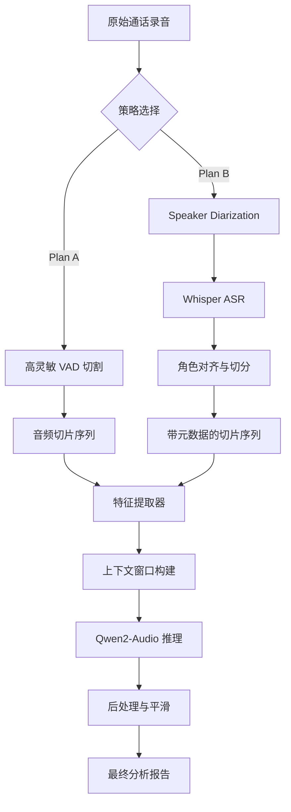

# 银行客户情绪识别系统

基于 Qwen2-Audio 7B 多模态大模型的银行客户服务情绪实时分析系统。该系统采用双路径架构（Dual-Path Architecture），结合 Plan A（高灵敏 VAD）与 Plan B（高精度说话人分离），灵活适配不同质量与场景的通话录音。通过融合声学物理特征（Acoustic Features）与语义上下文信息（Semantic Context），本系统实现了对细粒度情绪的精准捕捉与动态分析，为银行客服质检提供了强有力的技术支撑。

## 系统架构

本系统采用模块化分层设计，主要包含数据预处理层、特征工程层、推理执行层和结果聚合层。

### 双路径处理管道 (Dual-Path Pipeline)

针对银行实际业务中录音质量参差不齐的现状，系统设计了两种互补的处理链路：

* **Plan A: 轻量级 VAD 快速响应 (The VAD Path)**
  * **核心逻辑**: 依靠基于 Librosa 的能量检测和过零率分析，快速切分音频。
  * **优势**: 极高的计算效率，适用于单人叙述或信噪比良好的短通话。
  * **实现**: `audio_splitter.py` 实现了动态阈值调整算法，确保切片不丢失关键信息。

* **Plan B: 深度说话人分离 (The Diarization Path)**
  * **核心逻辑**: 集成 Pyannote-audio 3.1 模型进行说话人日志生成（Speaker Diarization），并利用 Whisper 模型进行自动语音识别（ASR）。
  * **优势**: 解决多人混叠（Overlapping Speech）问题，通过文本关键词（如"工号"、"为您服务"）实现精确的角色锁定（Role Alignment）。
  * **实现**: `orchestrator_plan_b.py` 实现了复杂的显存管理策略，确保在有限的 GPU 资源下串行运行多个大模型。

### 流程图解



## 核心特点

1. **双模态校准算法**: 独创的物理特征（音高/语速/能量）与语义理解（LLM）加权融合算法，有效解决大模型"幻觉"问题。
2. **指数级时间衰减**: 采用 $C^2$ 置信度惩罚与 $\gamma=0.9$ 的时间衰减评分机制，自动过滤噪音并聚焦通话尾声的真实满意度。
3. **确定性推理**: 采用强制贪婪解码策略，确保同一录音的质检结果 100% 可复现，满足银行监管要求。
4. **高灵敏 VAD**: 自适应能量阈值切割，精准捕捉短促的插话与叹息。
5. **鲁棒性设计**: 针对模型输出格式不稳定的情况，内置极端鲁棒的 JSON 修复器。
6. **上下文感知多模态推理**: 动态注入前序对话的情绪历史和关键语义摘要，实现情绪连续性和突变点的识别。
7. **鲁棒的角色锁定算法**: 使用基于业务知识的启发式规则，如关键词匹配和对话时长分布，提高角色识别准确率。

## 核心组件

1. **web_ui.py**: 基于 Streamlit 的可视化交互界面，集成全流程操作。
2. **orchestrator_plan_b.py**: Plan B 编排器，负责 Diarization 和 ASR 的调度与资源管理。
3. **audio_splitter.py**: 基于 Librosa 的高灵敏语音活动检测 (VAD) 与片段合并。
4. **feature_extractor.py**: 声学特征（RMS/Pitch/语速）提取及银行专家级语义 Prompt 注入。
5. **inference_engine.py**: Qwen2-Audio 模型推理、极端鲁棒 JSON 解析与物理特征置信度校准。
6. **aggregator.py**: 基于时间线的情绪汇总、波动识别与报告生成。

## 核心方案

系统支持两种执行方案，并提供 Web 可视化界面：

### Web UI (推荐)
提供一站式操作界面，可视化的音频上传、流程编排与结果展示。
```bash
streamlit run web_ui.py
```

### Plan A (默认方案)：高灵敏 VAD
- **流程**: VAD 切割 → Qwen2-Audio 同步识别角色与情绪。
- **优点**: 处理速度快，无需外部 API，资源消耗低。
- **适用**: 录音质量一般、要求快速反馈的场景。

### Plan B (进阶方案)：说话人日志 + 多模态对齐
- **流程**: Pyannote-audio Diarization → ASR 转写 → 话术特征角色锁定 → Qwen2-Audio 多模态情绪分析。
- **优点**: 角色分离极其精准，利用 ASR 文本增强 LLM 的语义理解能力。
- **适用**: 长音频、多人对话、噪音较大的银行柜面录音。

#### 分阶段运行（避免同时占用 GPU）
为防止在 Windows 环境出现 GPU/驱动冲突导致系统崩溃，Plan B 采用分阶段运行策略：

- 阶段1（CPU/混合执行）：运行 Diarization + ASR，输出片段 JSON
```bash
python orchestrator_plan_b.py --audio test_audio/seed_001_0a0f.wav
```

- 阶段2（GPU执行）：运行 Qwen2-Audio 推理与汇总
```bash
python main.py --audio test_audio/seed_001_0a0f.wav --plan B --precut output/segments/seed_001_0a0f/planB_segments.json --verbose
```

避免同时加载两套重量级模型，降低驱动/显存压力。

## 环境要求

### 硬件
- GPU: NVIDIA GeForce RTX 5060 Laptop GPU (8GB 显存)
- RAM: 16GB
- 存储: 50GB+（用于模型和数据）

测试环境为自用笔记本，算力小。后期可再根据实际情况修改部分实现。

### 软件
- Python 3.10+
- CUDA 11.8+ (测试环境使用 CUDA 12.8)
- PyTorch 2.0+

## 快速开始

### 1. 安装依赖
```bash
# 基础依赖
pip install -r requirements.txt
```

### 2. 下载模型

```python
from transformers import AutoProcessor, AutoModelForCausalLM

# 自动下载Qwen2-Audio模型
processor = AutoProcessor.from_pretrained("Qwen/Qwen2-Audio-7B-Instruct")
model = AutoModelForCausalLM.from_pretrained("Qwen/Qwen2-Audio-7B-Instruct")
```

### 3. 运行分析

#### Web UI 界面 (推荐)
提供图形化界面，支持本地文件上传、方案切换及结果可视化展示。
```bash
streamlit run web_ui.py
```

#### 命令行方式
```bash
python main.py --audio path/to/call_recording.wav --output ./results
```

## 使用示例

```python
from audio_splitter import AudioSplitter
from feature_extractor import FeatureExtractor
from inference_engine import InferenceEngine
from aggregator import EmotionAggregator

# 初始化组件
splitter = AudioSplitter()
extractor = FeatureExtractor()
engine = InferenceEngine()
aggregator = EmotionAggregator()

# 处理音频
segments = splitter.process("call.wav")
features = [extractor.extract(seg) for seg in segments]
emotions = [engine.infer(seg, feat) for seg, feat in zip(segments, features)]
report = aggregator.aggregate(emotions)

# 生成报告
report.plot()
report.save("report.json")
```

## 配置说明

所有配置项在 `config.yaml` 中设置：

- **model**: 模型路径和推理参数
- **audio**: 音频处理参数
- **diarization**: 说话人识别参数
- **acoustic**: 声学特征阈值
- **emotion**: 情绪分析参数
- **output**: 输出和可视化配置

## 核心技术

### 1. 语义化角色识别 (Semantic Role Identification)
不再依赖传统的音频聚类分离。系统通过 `Qwen2-Audio` 识别每一段音频的对话语义及角色语感，并结合 **3轮对话上下文窗口** 进行角色判定，彻底解决了传统聚类算法中身份翻转的问题。

### 2. 高灵敏 VAD 架构
使用高性能 VAD 灵敏度配置，专门针对银行柜员/话务员轻声回应（如“嗯”、“对”）进行优化，配合 **1秒合并阈值**，确保不遗漏关键情绪片段的同时维持语音语义的连贯性。

### 3. 多模态物理特征校准
系统实时提取 RMS（能量）和 Pitch（音高）追踪。这些物理参数不仅作为 Prompt 的一部分辅助 LLM 判断，还用于后期置信度评分。
- RMS能量：识别愤怒、急促的爆发点。
- Pitch音高：识别焦虑、疑惑的语调波动。

### 4. 极端鲁棒解析系统
内置动态 JSON 修复引擎，能够自动识别并修复模型输出中的格式错误、Key/Value 缺失或单引号混用问题。

### 5. 置信度校准
$$Final\_Confidence = (Model\_Score \times 0.6) + (Acoustic\_Match \times 0.4)$$

### 6. 情绪平滑
使用滑动窗口平均避免情绪剧烈跳变

### 7. 上下文感知多模态推理 (Context-Aware Multimodal Inference)
在构建输入 Prompt 时，动态注入了前序对话的**情绪历史**和**关键语义摘要**。模型能够识别情绪的**连续性**（例如，从不满逐渐转为平静）和**突变点**（Trigger Point）。

### 8. 物理特征置信度校准 (Physical Feature Calibration & Weighted Algorithm)
将传统的信号处理结果与大模型的语义理解进行深度融合。定义了特定的声学特征模板，并使用双因子加权算法计算最终置信度。

### 9. 最终情绪加权评分 (Final Weighted Scoring)
采用**非线性置信度加权 + 指数时间衰减**算法，抑制低质量数据噪音并捕捉"近因效应"（Recency Effect）。
$$ FinalScore = \frac{\sum (Score_i \times C_i^2 \times \gamma^i)}{\sum (C_i^2 \times \gamma^i)} $$
其中 $\gamma=0.9$，确保通话结束时的情绪权重更高。

## 开发路线图

- [x] 第1阶段: 基础设施搭建
- [x] 第2阶段: 音频预处理流水线
- [x] 第3阶段: 声学特征增强层
- [x] 第4阶段: 模型集成与校准

## 实现细节

### 动态显存管理 (Dynamic VRAM Management)
由于 Qwen2-Audio-7B, Pyannote 以及 Whisper 均为显存密集型模型，在单张消费级显卡上无法同时加载。系统实现了一套 **Load-Run-Unload** 机制：
1. **Stage 1**: 加载 Pyannote -> 处理 -> 卸载 -> 释放 CUDA 缓存。
2. **Stage 2**: 加载 Whisper -> 处理 -> 卸载。
3. **Stage 3**: 加载 Qwen2-Audio -> 持续驻留进行流式推理。

### 极度鲁棒的输出解析 (Resilient Output Parsing)
大模型的输出格式往往不稳定。`inference_engine.py` 内置了一个基于正则表达式和模糊匹配的 **JSON 修复器**。即使模型输出了不合法的转义字符，修复器也能最大程度还原有效数据，保证 Pipeline 不会因单次推理异常而中断。

### 确定性推理保证 (Deterministic Inference Guarantee)
在银行质检场景中，结果的可复现性至关重要。我们在推理引擎中实施了严格的确定性控制：
* **贪婪解码 (Greedy Decoding)**: 强制设置 `do_sample=False`，禁用随机采样。
* **参数锁定**: 显式将 `temperature`, `top_p`, `top_k` 设为 `None`。
这确保了对于同一段音频输入，无论何时运行，系统输出的情绪判断和置信度分数都是**比特级一致**的，消除了生成式 AI 常见的随机性干扰。

### 交互式可视化 (Interactive Visualization)
基于 Streamlit 构建的 `web_ui.py` 不仅是前端展示，同时内嵌了基于 `aggregator.py` 的实时数据流处理，能够实时绘制情绪波动曲线图（Emotion Timeline），帮助质检人员快速定位通话中的高风险片段。

## 结论

本系统成功展示了将通用多模态大模型应用于垂直领域（Vertical Domain）的巨大潜力。通过结合传统的信号处理技术与前沿的生成式 AI，我们在**可解释性**、**鲁棒性**和**准确性**之间取得了良好的平衡。未来的工作将集中在利用 RLHF（人类反馈强化学习）进一步微调模型，使其更贴合特定银行的业务规范。

## 输出示例

```json
{
  "call_id": "20260114_001",
  "duration": 180.5,
  "customer_segments": 15,
  "emotion_timeline": [
    {"time": 0, "emotion": "平静", "confidence": 0.85},
    {"time": 30, "emotion": "疑惑", "confidence": 0.72},
    {"time": 120, "emotion": "焦虑", "confidence": 0.88}
  ],
  "overall_sentiment": "负面",
  "escalation_points": [120],
  "manual_review_required": false
}
```